# CloudMCP GitHub Actions Workflows

This directory contains the modern, streamlined CI/CD workflows for CloudMCP. The workflows have been redesigned for 2024-2025 best practices with security hardening, fail-fast mechanisms, and optimal performance.

## Active Workflows

### 🚀 Core CI/CD Pipeline

#### Phase 1: Fast Feedback (`phase1-fast-feedback.yml`)
**Triggers**: Push to main/develop, Pull Requests  
**Duration**: ~3-5 minutes  
**Purpose**: Fail-fast quality checks

**What it does:**
- Static analysis with `staticcheck`
- Security scanning with `gosec`
- Comprehensive linting with `golangci-lint`
- Go formatting verification
- Go modules verification
- Basic build test

**Why Phase 1:**
- Provides rapid feedback to developers
- Catches common issues early
- Prevents resource waste on broken code
- Enables efficient development workflow

#### Phase 2: Full Testing (`phase2-full-testing.yml`)
**Triggers**: After Phase 1 succeeds, Manual dispatch  
**Duration**: ~8-12 minutes  
**Purpose**: Comprehensive validation

**What it does:**
- **Matrix Testing**: Unit, integration, and race tests on Go 1.23 & 1.24
- **Security Analysis**: Vulnerability scanning with `govulncheck` and `trivy`
- **SBOM Generation**: Lightweight software bill of materials
- **Multi-Platform Builds**: 5 platform combinations with security hardening
- **Container Testing**: Docker image functionality testing
- **SARIF Upload**: Security findings for GitHub Security tab

**Key Features:**
- Parallel execution for efficiency
- Comprehensive test coverage reporting
- Security-first approach
- Automated PR comments with results

### 📦 Release Management

#### Release (`release.yml`)
**Triggers**: Manual dispatch, Push to main (auto-release)  
**Duration**: ~10-15 minutes  
**Purpose**: Automated release creation

**Features:**
- **Dual Mode**: Manual releases with version control, auto-releases with conventional commits
- **Version Calculation**: Automatic semantic versioning based on commit messages
- **Security Hardening**: PIE binaries, static linking, symbol stripping
- **Multi-Platform**: 5 platform release binaries
- **Supply Chain Security**: Cosign signing, checksums, SBOM included
- **Smart Gating**: Prevents unnecessary releases

**Release Assets:**
- Security-hardened binaries for all platforms
- SHA256 checksums
- Cosign signature bundles
- Software Bill of Materials (SPDX & CycloneDX)

### 🔍 Maintenance

#### Dependency Review (`dependency-review.yml`)
**Triggers**: Monthly (first Monday), Manual dispatch, go.mod/go.sum changes  
**Duration**: ~5-8 minutes  
**Purpose**: Dependency health monitoring

**Features:**
- Monthly automated dependency reviews
- Security vulnerability detection
- Update availability analysis  
- Automated issue creation with priorities
- PR comments for dependency changes

## Security Features

### 🔐 Security Hardening
- **Action Pinning**: All actions pinned to specific SHA hashes
- **OIDC Authentication**: Keyless signing with GitHub OIDC
- **Minimal Permissions**: Least-privilege principle applied
- **Security Tools**: Verified tools with checksum validation
- **Supply Chain**: End-to-end artifact signing and SBOM generation

### 🛡️ Build Security
- **Hardened Builds**: PIE executables, static linking, symbol stripping
- **Reproducible**: Build ID removal, trimmed paths
- **Multi-Platform**: Security hardening per platform capabilities
- **Container Scanning**: Trivy security scanning with SARIF output

## Workflow Architecture

```mermaid
graph LR
    A[Code Push/PR] --> B[Phase 1: Fast Feedback]
    B --> C{Pass?}
    C -->|Yes| D[Phase 2: Full Testing]
    C -->|No| E[❌ Fail Fast]
    
    D --> F[Comprehensive Tests]
    D --> G[Security Analysis]  
    D --> H[Multi-Platform Builds]
    D --> I[Container Testing]
    
    F --> J{All Pass?}
    G --> J
    H --> J
    I --> J
    
    J -->|Yes| K[✅ Ready for Merge]
    J -->|No| L[❌ Fix Issues]
    
    M[Manual Release] --> N[Release Workflow]
    O[Auto Release Trigger] --> N
    N --> P[Build & Sign]
    N --> Q[Create Release]
```



## Migration from Legacy

The following workflows have been archived and replaced:

- `ci.yml` → Replaced by `phase1-fast-feedback.yml` + `phase2-full-testing.yml`
- `auto-release.yml` → Consolidated into `release.yml`
- `deprecation-monitoring.yml` → Functionality integrated into dependency review

### Benefits of New Architecture

1. **Faster Feedback**: Phase 1 provides results in 3-5 minutes vs 10-15 minutes
2. **Resource Efficiency**: No unnecessary compute on failing code
3. **Better Security**: Modern security practices with supply chain protection
4. **Simplified Maintenance**: Fewer workflows, clearer responsibilities
5. **Enhanced Reporting**: Better PR comments, security integration
6. **Future-Proof**: Designed for 2024-2025 best practices

## Usage Examples

### Manual Release
```bash
# Navigate to Actions tab → Release → Run workflow
# Select version type: patch/minor/major
# Choose prerelease: true/false
```

### Emergency Bypasses
```bash
# Skip Phase 1 for debugging (use sparingly)
# Actions tab → Phase 2: Full Testing → Run workflow → Skip Phase 1: true

# Skip auto-release
git commit -m "fix: emergency fix [skip release]"
```

### Force Dependency Review
```bash
# Actions tab → Dependency Review → Run workflow
```

## Monitoring and Alerts

- **GitHub Security Tab**: SARIF uploads for security findings
- **PR Comments**: Automated status updates on pull requests
- **Issues**: Monthly dependency review issues with priority labels
- **Artifacts**: Build artifacts and reports retained for analysis

## Configuration

Workflows use environment variables and repository settings:

- `GO_VERSION`: Go version for builds (currently 1.24)
- `GITHUB_TOKEN`: Automatic token for GitHub API access
- Repository secrets: None required (uses OIDC)

For questions or issues with workflows, see [CONTRIBUTING.md](../../CONTRIBUTING.md) or create an issue.