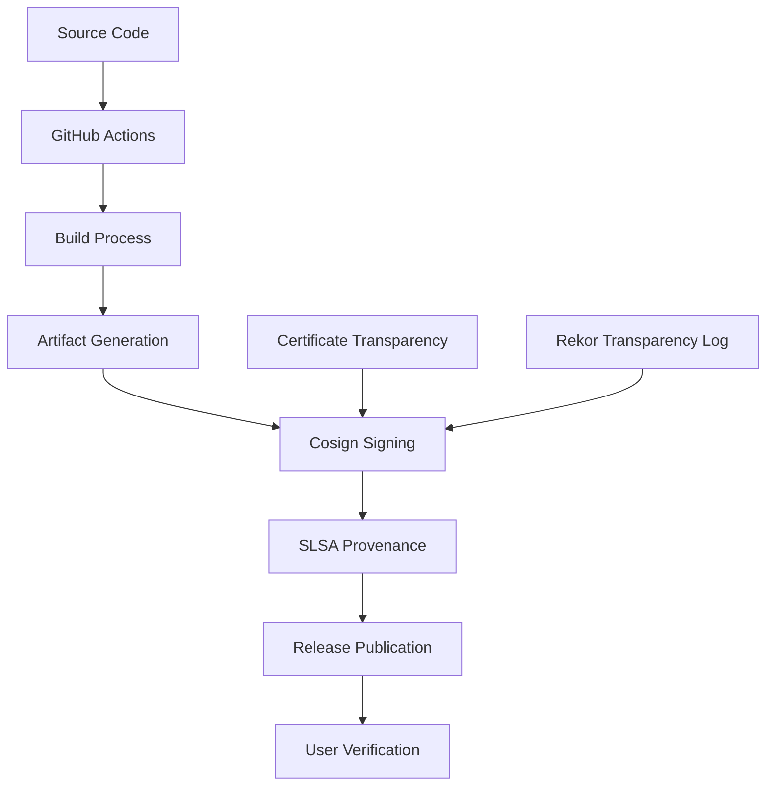

# CloudMCP Security Guide

This document provides comprehensive security information for CloudMCP, including artifact verification, supply chain security, and best practices.

## Table of Contents

- [Artifact Verification](#artifact-verification)
- [Supply Chain Security](#supply-chain-security)
- [SLSA Compliance](#slsa-compliance)
- [Container Security](#container-security)
- [Development Security](#development-security)
- [Verification Tools](#verification-tools)
- [Security Reporting](#security-reporting)
- [Best Practices](#best-practices)

## Artifact Verification

### Overview

All CloudMCP releases are cryptographically signed using [Sigstore](https://sigstore.dev/) cosign for supply chain security. This ensures artifact authenticity and integrity.

### Verification Methods

#### 1. Keyless Verification (Recommended)

CloudMCP uses keyless signing with GitHub OIDC for enhanced security:

```bash
# Install cosign
go install github.com/sigstore/cosign/v2/cmd/cosign@latest

# Verify binary signature (example for linux-amd64)
cosign verify-blob \
  --bundle cloud-mcp-linux-amd64.cosign.bundle \
  --certificate-identity-regexp="https://github.com/chadit/CloudMCP" \
  --certificate-oidc-issuer="https://token.actions.githubusercontent.com" \
  cloud-mcp-linux-amd64

# Verify checksums
cosign verify-blob \
  --bundle checksums.txt.cosign.bundle \
  --certificate-identity-regexp="https://github.com/chadit/CloudMCP" \
  --certificate-oidc-issuer="https://token.actions.githubusercontent.com" \
  checksums.txt
```

#### 2. Container Image Verification

```bash
# Verify container image signature
cosign verify \
  --certificate-identity-regexp="https://github.com/chadit/CloudMCP" \
  --certificate-oidc-issuer="https://token.actions.githubusercontent.com" \
  cloudmcp:latest
```

#### 3. Using Verification Scripts

CloudMCP provides automated verification scripts:

```bash
# Verify all artifacts
./scripts/verify-signatures.sh --binaries --checksums

# Verify container image
./scripts/verify-signatures.sh --container cloudmcp:latest

# Verify with SLSA provenance
./scripts/verify-signatures.sh --binaries --checksums --slsa slsa-provenance.intoto.jsonl

# Strict verification mode
./scripts/verify-signatures.sh --strict --verbose
```

### Verification Process

1. **Download artifacts** from GitHub releases
2. **Install cosign** for signature verification
3. **Verify signatures** using keyless verification
4. **Validate checksums** against downloaded binaries
5. **Check SLSA provenance** for build integrity

### Signature Bundle Format

CloudMCP uses signature bundles (`.cosign.bundle`) that contain:
- Digital signature
- Certificate chain
- Transparency log entries
- Timestamps

## Supply Chain Security

### Security Architecture



### Security Controls

#### Build Security
- **Reproducible builds** with pinned dependencies
- **Isolated build environments** in GitHub Actions
- **Multi-architecture builds** for platform diversity
- **Comprehensive testing** before artifact generation

#### Signing Security
- **Keyless signing** eliminates long-term key management risks
- **OIDC authentication** with GitHub identity verification
- **Certificate transparency** for audit trails
- **Immutable transparency logs** (Rekor) for non-repudiation

#### Distribution Security
- **Signed artifacts** prevent tampering during distribution
- **Checksum validation** ensures download integrity
- **HTTPS-only distribution** through GitHub releases
- **Public audit trails** via transparency logs

### Threat Model

#### Threats Addressed
- ✅ **Malicious artifacts**: Digital signatures prevent tampered binaries
- ✅ **Supply chain attacks**: SLSA provenance ensures build integrity
- ✅ **Compromised distribution**: Signatures detect tampering
- ✅ **Insider threats**: Keyless signing requires OIDC authentication

#### Threats Not Addressed
- ⚠️ **Compromised source code**: Code review and security scanning required
- ⚠️ **Build environment compromise**: Monitored but not prevented
- ⚠️ **Runtime security**: Application-level security measures needed

## SLSA Compliance

### SLSA Level 3 Requirements

CloudMCP achieves **SLSA Level 3** compliance:

| Requirement | Implementation | Status |
|-------------|---------------|---------|
| Source integrity | Git commit-based builds | ✅ |
| Build service | GitHub Actions hosted runners | ✅ |
| Provenance | SLSA provenance generation | ✅ |
| Isolation | Ephemeral build environments | ✅ |
| Parametric | Build parameters recorded | ✅ |
| Hermetic | Reproducible builds | ✅ |

### Provenance Verification

SLSA provenance provides build metadata:

```bash
# Download provenance file from release
curl -LO https://github.com/chadit/CloudMCP/releases/download/v1.0.0/slsa-provenance.intoto.jsonl

# Verify provenance signature
cosign verify-blob \
  --bundle slsa-provenance.intoto.jsonl.cosign.bundle \
  --certificate-identity-regexp="https://github.com/chadit/CloudMCP" \
  --certificate-oidc-issuer="https://token.actions.githubusercontent.com" \
  slsa-provenance.intoto.jsonl

# Examine provenance content
cat slsa-provenance.intoto.jsonl | jq .
```

### Build Integrity

Provenance includes:
- Source repository and commit SHA
- Build workflow and parameters
- Builder identity and platform
- Artifact checksums and metadata

## Container Security

### Image Signing

All container images are signed with cosign:

```bash
# Pull and verify image
docker pull cloudmcp:latest

# Verify image signature
cosign verify \
  --certificate-identity-regexp="https://github.com/chadit/CloudMCP" \
  --certificate-oidc-issuer="https://token.actions.githubusercontent.com" \
  cloudmcp:latest
```

### Security Scanning

Container images undergo comprehensive security scanning:

- **Base image vulnerabilities** (Alpine Linux scanning)
- **Dependency vulnerabilities** (Go module scanning)
- **Configuration security** (Dockerfile best practices)
- **Runtime security** (Non-root user, minimal permissions)

### Security Features

#### Image Hardening
- **Minimal base image** (Alpine Linux)
- **Non-root execution** (dedicated user account)
- **Read-only filesystem** where possible
- **No package managers** in production images

#### Runtime Security
- **Health checks** for availability monitoring
- **Resource limits** to prevent resource exhaustion
- **Security contexts** for privilege restriction
- **Network policies** for traffic control

## Development Security

### Source Code Security

#### Static Analysis
- **Security scanning** with gosec
- **Dependency checking** with govulncheck
- **Code quality** with golangci-lint
- **License compliance** scanning

#### Token Security
CloudMCP implements comprehensive token security:

```bash
# Validate token security
./scripts/validate-test-tokens.sh

# Check for token exposure
./scripts/check-file-permissions.sh
```

#### Security Testing
- **Unit tests** for security functions
- **Integration tests** with security validation
- **Container security** testing framework
- **Token validation** in CI/CD

### CI/CD Security

#### Workflow Security
- **Minimum permissions** principle
- **Secret scanning** for credentials
- **Dependency pinning** for reproducibility
- **Branch protection** rules

#### Environment Security
- **Ephemeral runners** for isolation
- **Secret management** via GitHub Secrets
- **Audit logging** for all operations
- **Security notifications** for vulnerabilities

## Verification Tools

### Automated Scripts

CloudMCP provides comprehensive verification tools:

#### Signing Script
```bash
# Sign all artifacts
./scripts/sign-artifacts.sh --binaries --checksums --container cloudmcp:latest

# Sign with verification
./scripts/sign-artifacts.sh --binaries --verify

# Custom signing
./scripts/sign-artifacts.sh --container cloudmcp:v1.0.0 --verbose
```

#### Verification Script
```bash
# Basic verification
./scripts/verify-signatures.sh

# Comprehensive verification
./scripts/verify-signatures.sh --binaries --checksums --container cloudmcp:latest --slsa provenance.jsonl

# Strict mode verification
./scripts/verify-signatures.sh --strict --verbose
```

### Manual Verification

#### Step-by-Step Process

1. **Install cosign**:
   ```bash
   go install github.com/sigstore/cosign/v2/cmd/cosign@latest
   ```

2. **Download artifacts**:
   ```bash
   curl -LO https://github.com/chadit/CloudMCP/releases/download/v1.0.0/cloud-mcp-linux-amd64
   curl -LO https://github.com/chadit/CloudMCP/releases/download/v1.0.0/cloud-mcp-linux-amd64.cosign.bundle
   curl -LO https://github.com/chadit/CloudMCP/releases/download/v1.0.0/checksums.txt
   curl -LO https://github.com/chadit/CloudMCP/releases/download/v1.0.0/checksums.txt.cosign.bundle
   ```

3. **Verify signatures**:
   ```bash
   cosign verify-blob \
     --bundle cloud-mcp-linux-amd64.cosign.bundle \
     --certificate-identity-regexp="https://github.com/chadit/CloudMCP" \
     --certificate-oidc-issuer="https://token.actions.githubusercontent.com" \
     cloud-mcp-linux-amd64
   ```

4. **Validate checksums**:
   ```bash
   sha256sum -c checksums.txt
   ```

#### Verification Checklist

- [ ] cosign installed and available
- [ ] Artifacts downloaded from official releases
- [ ] Signatures verified successfully
- [ ] Checksums validated
- [ ] SLSA provenance checked (if available)
- [ ] Certificate identity matches repository
- [ ] OIDC issuer matches GitHub Actions

## Security Reporting

### Vulnerability Disclosure

If you discover a security vulnerability in CloudMCP:

1. **Do not** create a public issue
2. **Email** security concerns to: [security@cloudmcp.dev]
3. **Include** detailed information about the vulnerability
4. **Allow** reasonable time for response and remediation

### Security Response

Our security response process:

1. **Acknowledgment** within 24 hours
2. **Initial assessment** within 72 hours
3. **Remediation timeline** based on severity
4. **Public disclosure** after fixes are available

### Security Updates

Stay informed about security updates:

- **GitHub Security Advisories** for vulnerability notifications
- **Release notes** for security-related changes
- **Security changelog** for detailed security information

## Best Practices

### For Users

#### Verification Best Practices
- **Always verify signatures** before using artifacts
- **Check certificate identity** matches the official repository
- **Validate checksums** for downloaded files
- **Use latest versions** for security updates
- **Monitor security advisories** for notifications

#### Deployment Security
- **Use official images** from verified sources
- **Apply security updates** promptly
- **Configure monitoring** for security events
- **Implement access controls** for production systems
- **Regular security audits** of deployments

### For Developers

#### Development Security
- **Enable security scanning** in development environment
- **Use security linting** tools
- **Follow secure coding** practices
- **Validate dependencies** regularly
- **Keep tools updated** for latest security features

#### Contributing Security
- **Security-focused code reviews** for all changes
- **Test security features** thoroughly
- **Document security implications** of changes
- **Follow responsible disclosure** for vulnerabilities
- **Maintain security awareness** through training

### For Organizations

#### Policy Recommendations
- **Require signature verification** for all artifacts
- **Implement SLSA compliance** requirements
- **Establish vulnerability management** processes
- **Create incident response** procedures
- **Regular security assessments** of supply chain

#### Technical Controls
- **Automated verification** in CI/CD pipelines
- **Policy enforcement** for signed artifacts only
- **Monitoring and alerting** for security events
- **Regular security scanning** of dependencies
- **Supply chain risk assessment** processes

## Advanced Topics

### Custom Verification

For organizations with specific requirements:

#### Policy Engine Integration
```bash
# OPA policy for signature verification
package cloudmcp.security

default allow = false

allow {
    input.signature_verified == true
    input.certificate_identity == "https://github.com/chadit/CloudMCP"
    input.oidc_issuer == "https://token.actions.githubusercontent.com"
}
```

#### Continuous Verification
```bash
# Periodic verification script
#!/bin/bash
# Add to cron for regular verification
./scripts/verify-signatures.sh --strict --verbose >> /var/log/cloudmcp-verification.log 2>&1
```

### Integration Examples

#### Kubernetes
```yaml
# Pod Security Policy requiring signature verification
apiVersion: v1
kind: Pod
metadata:
  annotations:
    cosign.sigstore.dev/signature: "verified"
spec:
  containers:
  - name: cloudmcp
    image: cloudmcp:latest
    securityContext:
      readOnlyRootFilesystem: true
      runAsNonRoot: true
      runAsUser: 1000
```

#### Docker Compose
```yaml
# Docker Compose with signature verification
version: '3.8'
services:
  cloudmcp:
    image: cloudmcp:latest
    environment:
      - COSIGN_VERIFY=true
    security_opt:
      - no-new-privileges:true
    read_only: true
```

## Appendix

### Glossary

- **cosign**: Tool for signing and verifying container images and artifacts
- **SLSA**: Supply-chain Levels for Software Artifacts framework
- **OIDC**: OpenID Connect authentication protocol
- **Rekor**: Transparency log for software supply chain artifacts
- **Sigstore**: Set of free tools for code signing and verification

### References

- [Sigstore Documentation](https://docs.sigstore.dev/)
- [SLSA Framework](https://slsa.dev/)
- [cosign Documentation](https://docs.sigstore.dev/cosign/overview/)
- [NIST Software Supply Chain Security](https://csrc.nist.gov/Projects/ssdf)
- [GitHub OIDC Documentation](https://docs.github.com/en/actions/deployment/security-hardening-your-deployments/about-security-hardening-with-openid-connect)

### Version History

| Version | Date | Changes |
|---------|------|---------|
| 1.0.0 | 2024-01-20 | Initial security documentation with cosign implementation |

---

**Note**: This security guide is regularly updated. Check the [latest version](https://github.com/chadit/CloudMCP/blob/main/docs/SECURITY.md) for current information.